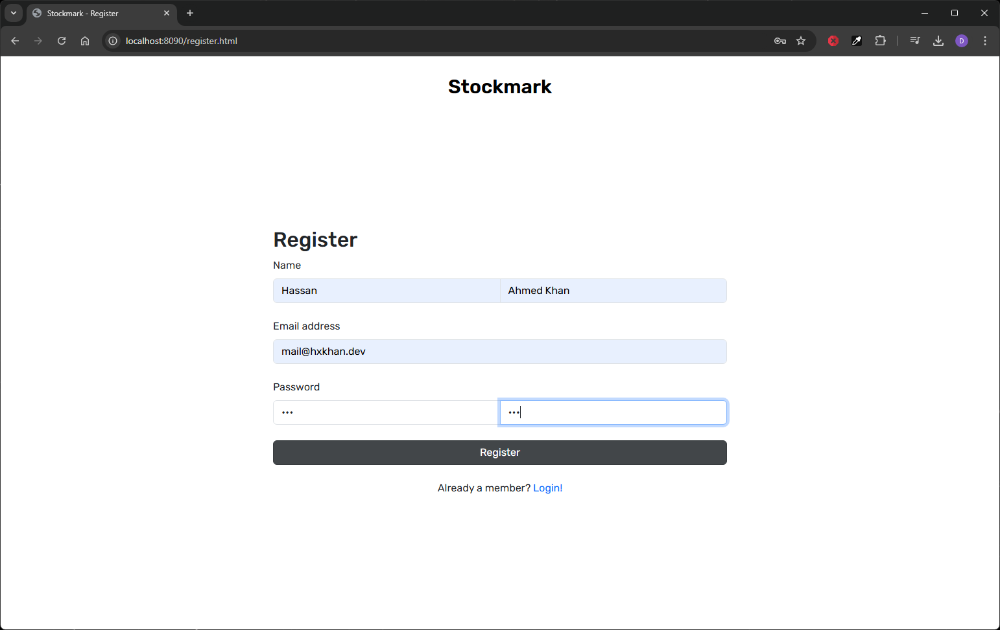
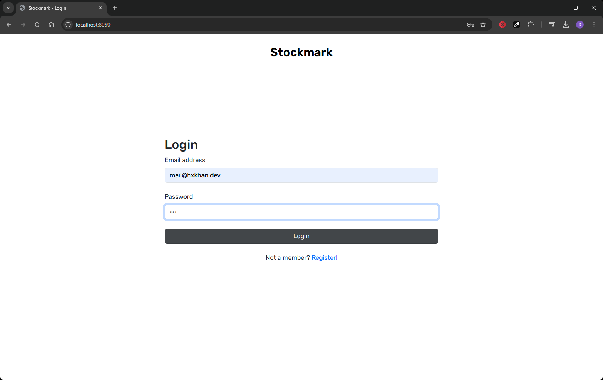
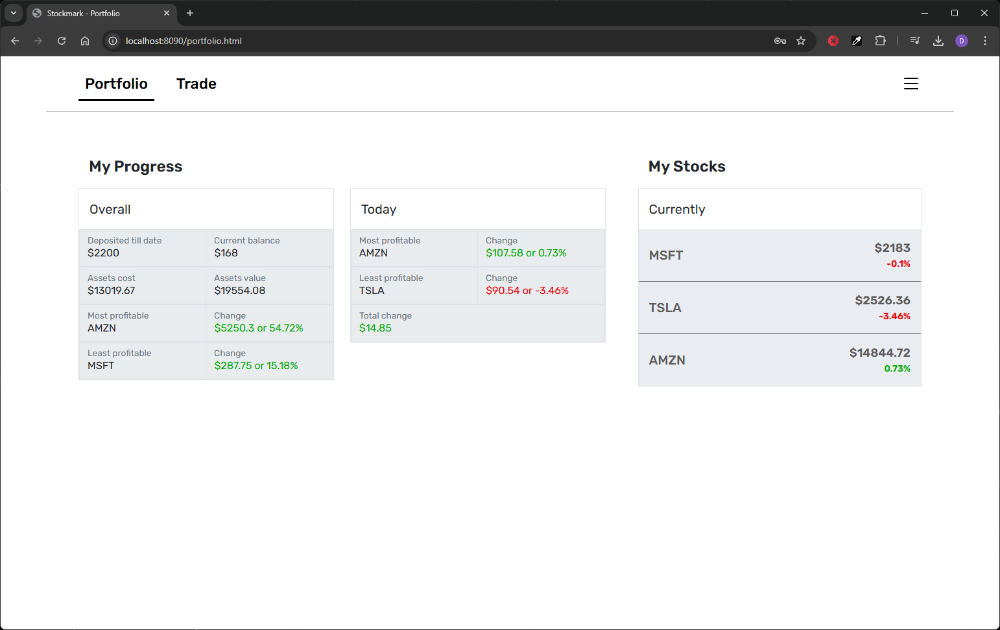
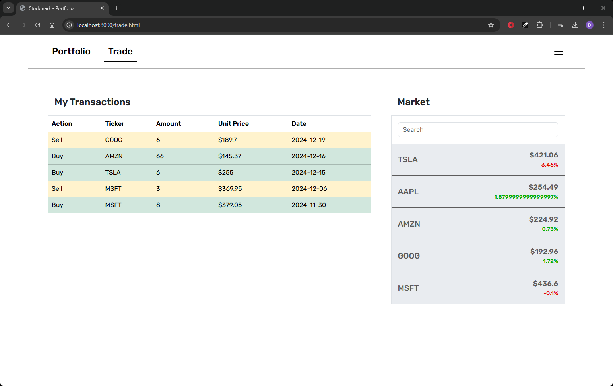
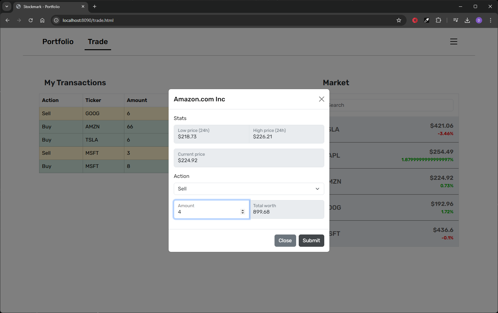
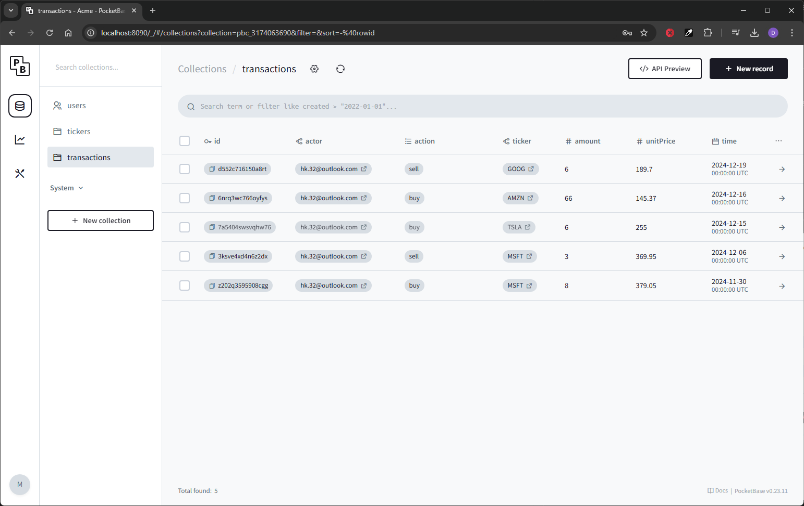

# Stockmark

Test your investment skills with real world stock prices and unlimited capital. Deposit money with a simple popup in the top right corner and start investing!

## Tech stack
1. Golang http stdlib as the server framework for backend
2. SQLITE as the SQL database provided by pocketbase 
3. Frontend is vanilla html/css/js but depends on Bootstrap 5 for default styling

## App flow
### Register

### Login

### Portfolio

### Trade

### Trade Popup

### Admin Panel

## Steps to run the app
1. Have [Golang](https://go.dev/) installed
2. `git clone https://github.com/hxkhan/stockmark.git`
3. `cd stockmark`
4. Build & Serve `go build -o main.exe . && main serve`